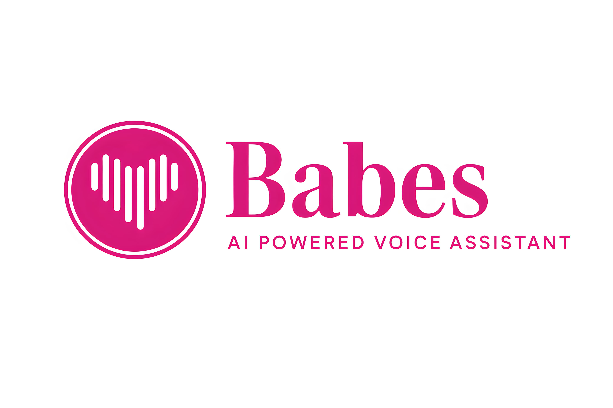

# Babes AI Assistant



### Contact Information 
Instagram : https://www.instagram.com/programmer_deepak/
Youtube : https://youtu.be/P6T88JqH09Y?si=rlcBm6Z6nqlCGzXg
Email : goodvibesdeepak@gmail.com
Check Video On Instagram Or On Youtube To See Demo and Know About Babes

A sophisticated voice-controlled desktop assistant with natural language processing capabilities, built with Python and PyQt5.

## Features

- 🎙️ Voice command recognition
- 📅 Calendar and time management
- 📝 Todo list management
- 📸 Screenshot capture
- 🔍 Web search integration
- 🧮 WolframAlpha calculations
- 🎵 Media control
- 🖥️ System monitoring
- 💬 Chat history

## Installation

### Prerequisites
- Python 3.8+
- Windows/macOS/Linux

### Steps
1. Clone the repository:
   ```bash
   git clone https://github.com/yourusername/BabesAI-Assistant.git
   cd BabesAI-Assistant

2.pip install -r requirements.txt

3.Configure WolframAlpha API (optional):

Get API key from WolframAlpha

Add it to Babes/config.py

4.Install Anacode For Your Device and run Conda Activate [virtual environment]
5.Run main.py 


### List Of Commands 
(docs/Babes%20Commands.pdf)

### Add Music Files in Music Folder 
to Run Command Play Music 

### Wake Words 
Hey Babes
